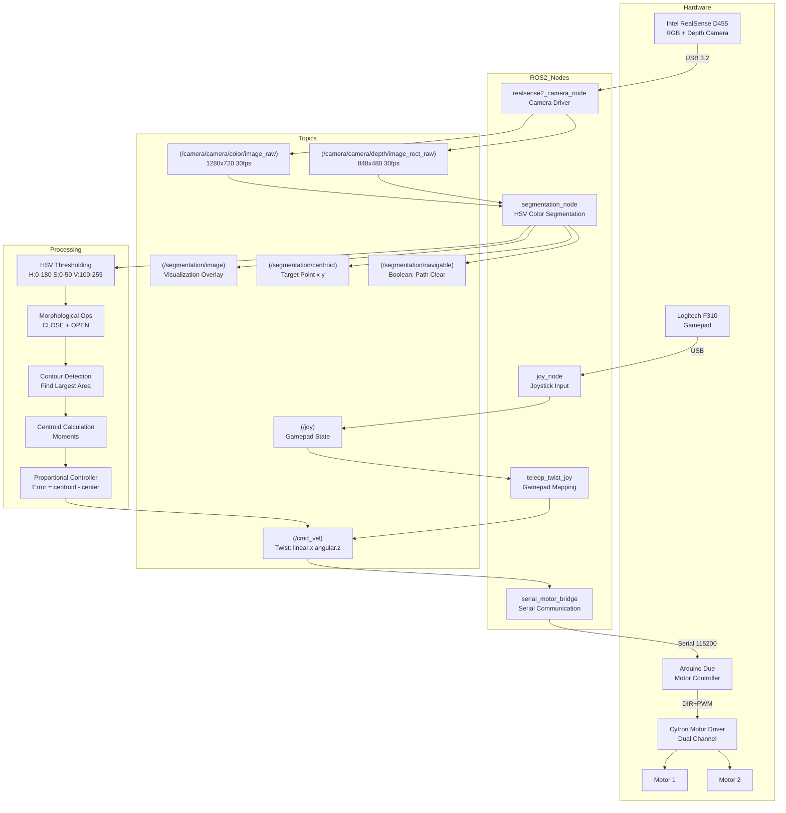
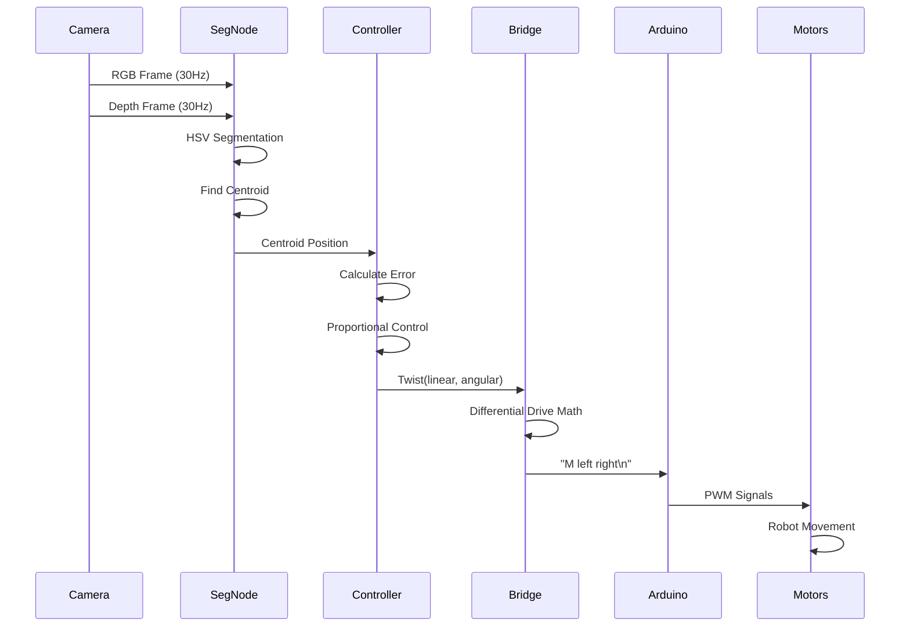
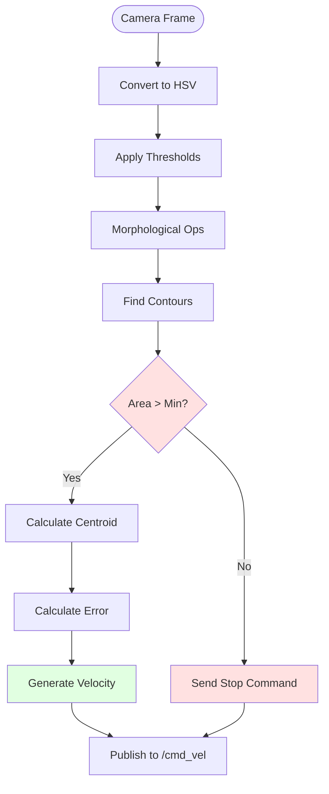

# RealSense Navigation System Architecture



## Key Components

### 1. **Input Layer**
- **RealSense D455**: RGB (1280x720) + Depth (848x480) @ 30fps
- **Gamepad**: Logitech F310 for manual control

### 2. **Processing Layer**
- **Segmentation Pipeline**:
  - RGB → HSV conversion
  - Color thresholding (floor detection)
  - Morphological operations (noise removal)
  - Contour detection (find navigable area)
  - Centroid calculation (target point)
  
- **Control Algorithm**:
  - Proportional control: `angular = -gain × (centroid_x - center_x)`
  - Linear velocity: `linear = gain × (1 - |error|)`

### 3. **Output Layer**
- **Velocity Commands**: `/cmd_vel` (Twist messages)
- **Serial Bridge**: Converts Twist → Arduino commands
- **Motor Control**: DIR+PWM signals to Cytron driver

## Data Flow



## Navigation Logic



## Control Equations

**Angular Velocity:**
```
error_x = (centroid_x - center_x) / center_x  # Normalized [-1, 1]
angular_vel = -angular_gain × error_x         # Negative for correct steering
angular_vel = clip(angular_vel, -max_angular, max_angular)
```

**Linear Velocity:**
```
linear_vel = linear_gain × (1 - |error_x|)    # Slow down when turning
linear_vel = clip(linear_vel, 0, max_linear)
```

**Differential Drive:**
```
v_left = linear - (wheel_sep/2) × angular
v_right = linear + (wheel_sep/2) × angular
pwm_left = 255 × (v_left / max_speed)
pwm_right = 255 × (v_right / max_speed)
```
