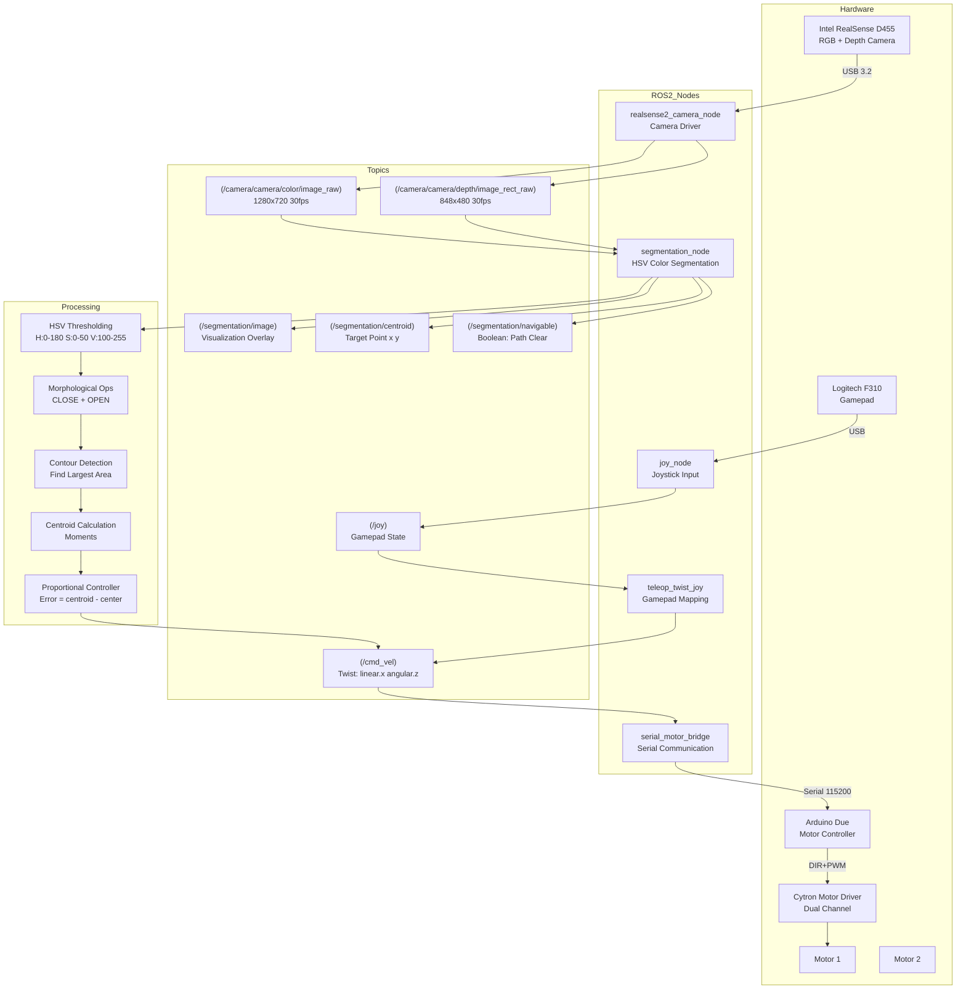
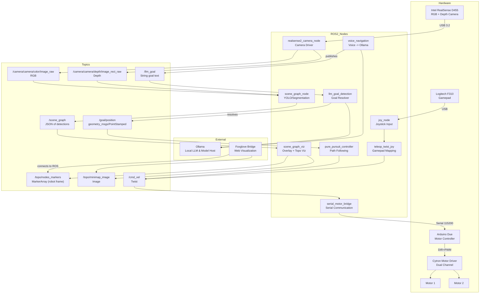
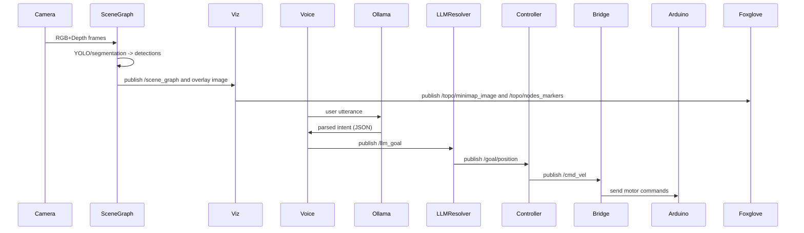

# RealSense Navigation System Architecture

## Diagram — Version 1 (HSV-based segmentation)



## Diagram — Version 2 (SegFormer-based segmentation + LLM/Voice)

# RealSense Navigation System Architecture (updated)



## Key Additions (summary)

- Scene Graph: `scene_graph_node` produces compact JSON detections (`/scene_graph`) using YOLO or segmentation results.
- Visualization: `scene_graph_viz` publishes overlay images plus persistent topological node markers (`/topo/nodes_markers`) and a robot-centric mini-map image (`/topo/minimap_image`).
- LLM-powered goal resolution: `llm_goal_detection` consumes `/llm_goal` (natural-language goal strings) and resolves them to topological goals and a `/goal/position` that the controller can follow.
- Voice interface: `voice_navigation` captures microphone input, sends it to Ollama (local LLM) for parsing, and publishes normalized `/llm_goal` commands. Ollama must be installed locally and the chosen model pulled (e.g. Llama 3.1 8B).
- Foxglove Bridge: started by the full launch to provide web visualization for MarkerArray and images.

## Data Flow (high-level)



## Navigation Logic (extended with topology and LLM)

```mermaid
flowchart TD
    CAMERA([Camera frames]) --> SG[Scene Graph: detections]
    SG --> VIZ[Persist/visualize topo nodes]
    VIZ --> MAP[Mini-map (robot centric)]
    VOICE[[Voice input]] --> OLLAMA[Ollama LLM]
    OLLAMA --> LLMNODE[llm_goal_detection]
    LLMNODE --> GOAL[Selected topo goal]
    GOAL --> CONTROLLER[pure_pursuit_controller]
    CONTROLLER --> CMD[/cmd_vel]
    CMD --> BRIDGE
    BRIDGE --> MOTORS

    style GOAL fill:#e6f7ff
    style MAP fill:#fff3e6
```

## Notes and Operational Guidance

- Ollama requirement: `voice_navigation` and `llm_goal_detection` rely on a local Ollama installation and an available model (configured in `voice_llm_navigator/config/llm_config.yaml`). The project includes `tools/check_ollama.sh` to verify the CLI and model availability.
- Frame conventions: `scene_graph_viz` attempts to transform detections from the camera frame into a configurable `topo_frame` (default `base_link`) using TF. If TF is available, topo markers and the mini-map are published in robot-centric coordinates.
- Visualization: use Foxglove Studio or RViz to inspect `/topo/nodes_markers` and `/topo/minimap_image` (Foxglove bridge is started by the full launch to expose topics to the browser).

## Backwards-compatible pieces

- Manual controls (gamepad, teleop) and the serial motor bridge remain unchanged.
- The pure pursuit controller still accepts `/goal/position` and `/goal/detected` topics and outputs `/cmd_vel`.
 
## Message Schemas

This section documents the message payloads used by the scene-graph and topo visualization pieces so you can produce mock messages or write consumers.

1) `/scene_graph` (std_msgs/String)

- Topic type: `std_msgs/msg/String` where `data` contains a JSON object with a top-level `objects` array.
- Purpose: a compact representation of detected objects (from YOLO or segmentation) including pixel centroids and an estimated depth. The node that produces this is `scene_graph_node`.

Example value for `msg.data` (pretty-printed JSON):

```json
{
    "frame_id": "camera_link",
    "timestamp": 1698770000.123,
    "objects": [
        {
            "id": 1,
            "label": "chair",
            "conf": 0.87,
            "bbox": [120, 80, 200, 300],         
            "centroid_px": [220.5, 230.1],
            "depth_m": 1.73,
            "area": 60000
        },
        {
            "id": 2,
            "label": "person",
            "conf": 0.76,
            "bbox": [400, 60, 120, 340],
            "centroid_px": [460.2, 230.5],
            "depth_m": 2.10,
            "area": 35000
        }
    ]
}
```

Field notes:
- `frame_id`: the camera frame the centroids/depths are relative to (string).
- `timestamp`: float seconds (epoch) — optional but useful for synchronization.
- `id`: integer identifier (should be stable while object is persistent across frames where possible).
- `label`: class label string from YOLO or segmentation (may be `null` for unlabeled masks).
- `conf`: confidence [0..1] for classifiers (optional for mask detections).
- `bbox`: [x, y, width, height] in pixel coordinates (top-left origin).
- `centroid_px`: [u, v] pixel coordinates of the object's centroid.
- `depth_m`: estimated depth in meters at the centroid (used for triangulation into camera frame coordinates).
- `area`: pixel area of the mask / bbox area (optional, used for heuristics like \"largest\").

2) `/topo/nodes_markers` (visualization_msgs/MarkerArray)

- Topic type: `visualization_msgs/msg/MarkerArray`. Each persistent topo node is published as two markers:
    - A `SPHERE` marker in namespace `topo_nodes` with the node ID; pose position is the node location expressed in the configured `topo_frame` (for example `base_link` or `odom`).
    - A `TEXT_VIEW_FACING` marker in namespace `topo_nodes_text` with the same ID*100 used for label display.

RViz marker fields of interest (per Marker):
- `header.frame_id`: the coordinate frame the position is expressed in (e.g. `base_link`).
- `id`: integer unique per marker (use consistent ID for add/modify/delete behavior).
- `ns`: namespace string (e.g. `topo_nodes`).
- `type`: visualization type (SPHERE or TEXT_VIEW_FACING).
- `pose.position.x/y/z`: coordinates of the node in `topo_frame`.
- `scale`: visual size in meters.
- `color.r/g/b/a`: RGBA color.

JSON-like pseudo-example (for clarity — the actual topic is MarkerArray, not JSON):

```json
{
    "markers": [
        {
            "header": {"frame_id": "base_link", "stamp": 1698770000.456},
            "ns": "topo_nodes",
            "id": 1,
            "type": "SPHERE",
            "pose": {"position": {"x": 1.73, "y": -0.22, "z": 0.0}},
            "scale": {"x": 0.08, "y": 0.08, "z": 0.08},
            "color": {"r": 0.0, "g": 0.5, "b": 1.0, "a": 0.9}
        },
        {
            "header": {"frame_id": "base_link", "stamp": 1698770000.456},
            "ns": "topo_nodes_text",
            "id": 100,
            "type": "TEXT_VIEW_FACING",
            "pose": {"position": {"x": 1.73, "y": -0.22, "z": 0.12}},
            "scale": {"z": 0.08},
            "color": {"r": 1, "g": 1, "b": 1, "a": 1},
            "text": "chair:1"
        }
    ]
}
```

Notes and consumer guidance:
- The MarkerArray form is standard for RViz/Foxglove; if other nodes need structured access to robot-centric node positions consider subscribing to `/topo/nodes_markers` and converting Marker -> Point or add a dedicated `/topo/nodes_positions` topic (PointStamped list) for programmatic consumption.
- Marker lifetimes: persistent topo nodes are published with no automatic lifetime (managed by the publishing node). If you implement auto-removal, use Marker action DELETE with the same `ns`/`id` to remove.
- Frame transforms: the producer attempts to transform camera-frame coordinates into the `topo_frame` using TF2. If TF is missing the markers may be published in the camera frame; ensure your RViz fixed frame matches the `topo_frame` to see the nodes in robot-centric coordinates.
# RealSense Navigation System Architecture

## Diagram — Version 1 (HSV-based segmentation)

```mermaid
graph TB
    subgraph Hardware
        RS[Intel RealSense D455<br/>RGB + Depth Camera]
        ARD[Arduino Due<br/>Motor Controller]
        MOT[Cytron Motor Driver<br/>Dual Channel]
        M1[Motor 1]
        M2[Motor 2]
        JOY[Logitech F310<br/>Gamepad]
    end

    subgraph ROS2_Nodes
        CAM[realsense2_camera_node<br/>Camera Driver]
        SEG[segmentation_node<br/>HSV Color Segmentation]
        BRIDGE[serial_motor_bridge<br/>Serial Communication]
        JOYNODE[joy_node<br/>Joystick Input]
        TELEOP[teleop_twist_joy<br/>Gamepad Mapping]
    end

    subgraph Topics
        RGB["(/camera/camera/color/image_raw)<br/>1280x720 30fps"]
        DEPTH["(/camera/camera/depth/image_rect_raw)<br/>848x480 30fps"]
        CMDVEL["(/cmd_vel)<br/>Twist: linear.x angular.z"]
        SEGIMG["(/segmentation/image)<br/>Visualization Overlay"]
        CENT["(/segmentation/centroid)<br/>Target Point x y"]
        NAV["(/segmentation/navigable)<br/>Boolean: Path Clear"]
        JOYCMD["(/joy)<br/>Gamepad State"]
    end

    subgraph Processing
        HSV["HSV Thresholding<br/>H:0-180 S:0-50 V:100-255"]
        MORPH["Morphological Ops<br/>CLOSE + OPEN"]
        CONT["Contour Detection<br/>Find Largest Area"]
        CENTR["Centroid Calculation<br/>Moments"]
        CTRL["Proportional Controller<br/>Error = centroid - center"]
    end

    RS -->|USB 3.2| CAM
    CAM --> RGB
    CAM --> DEPTH
    
    RGB --> SEG
    DEPTH --> SEG
    
    SEG --> HSV
    HSV --> MORPH
    MORPH --> CONT
    CONT --> CENTR
    CENTR --> CTRL
    
    CTRL --> CMDVEL
    SEG --> SEGIMG
    SEG --> CENT
    SEG --> NAV
    
    JOY -->|USB| JOYNODE
    JOYNODE --> JOYCMD
    JOYCMD --> TELEOP
    TELEOP --> CMDVEL
    
    CMDVEL --> BRIDGE
    BRIDGE -->|Serial 115200| ARD
    ARD -->|DIR+PWM| MOT
    MOT --> M1
    ```

    ## Diagram — Version 2 (SegFormer-based segmentation + LLM/Voice)

    # RealSense Navigation System Architecture (updated)

    ```mermaid
    graph TB
        subgraph Hardware
            RS[Intel RealSense D455<br/>RGB + Depth Camera]
            ARD[Arduino Due<br/>Motor Controller]
            MOT[Cytron Motor Driver<br/>Dual Channel]
            M1[Motor 1]
            M2[Motor 2]
            JOY[Logitech F310<br/>Gamepad]
        end

        subgraph ROS2_Nodes
            CAM[realsense2_camera_node<br/>Camera Driver]
            SCENE[scene_graph_node<br/>YOLO/Segmentation]
            VIZ[scene_graph_viz<br/>Overlay + Topo Viz]
            LLMNODE[llm_goal_detection<br/>Goal Resolver]
            VOICE[voice_navigation<br/>Voice -> Ollama]
            PCTRL[pure_pursuit_controller<br/>Path Following]
            BRIDGE[serial_motor_bridge<br/>Serial Communication]
            JOYNODE[joy_node<br/>Joystick Input]
            TELEOP[teleop_twist_joy<br/>Gamepad Mapping]
        end

        subgraph External
            OLLAMA[Ollama<br/>Local LLM & Model Host]
            FOX[Foxglove Bridge<br/>Web Visualization]
        end

        subgraph Topics
            RGB["/camera/camera/color/image_raw<br/>RGB"]
            DEPTH["/camera/camera/depth/image_rect_raw<br/>Depth"]
            SCENE_T["/scene_graph<br/>JSON of detections"]
            TOPO_MARK["/topo/nodes_markers<br/>MarkerArray (robot frame)"]
            MINIMAP["/topo/minimap_image<br/>Image"]
            LLM_GOAL["/llm_goal<br/>String goal text"]
            GOAL_POS["/goal/position<br/>geometry_msgs/PointStamped"]
            CMDVEL["/cmd_vel<br/>Twist"]
        end

        RS -->|USB 3.2| CAM
        CAM --> RGB
        CAM --> DEPTH

        RGB --> SCENE
        DEPTH --> SCENE

        SCENE --> SCENE_T
        SCENE_T --> VIZ
        VIZ --> TOPO_MARK
        VIZ --> MINIMAP

    %% LLM / voice flow
        VOICE -->|publishes| LLM_GOAL
        LLM_GOAL --> LLMNODE
        LLMNODE -->|resolves| GOAL_POS
        GOAL_POS --> PCTRL

    %% controller and bridge
        PCTRL --> CMDVEL
        CMDVEL --> BRIDGE
        BRIDGE -->|Serial 115200| ARD
        ARD -->|DIR+PWM| MOT
        MOT --> M1
        MOT --> M2

    %% external services
        VOICE --> OLLAMA
        LLMNODE --> OLLAMA
        FOX -->|connects to ROS| TOPO_MARK
        FOX --> MINIMAP

        JOY -->|USB| JOYNODE
        JOYNODE --> TELEOP
        TELEOP --> CMDVEL

    ```

    ## Key Additions (summary)

    - Scene Graph: `scene_graph_node` produces compact JSON detections (`/scene_graph`) using YOLO or segmentation results.
    - Visualization: `scene_graph_viz` publishes overlay images plus persistent topological node markers (`/topo/nodes_markers`) and a robot-centric mini-map image (`/topo/minimap_image`).
    - LLM-powered goal resolution: `llm_goal_detection` consumes `/llm_goal` (natural-language goal strings) and resolves them to topological goals and a `/goal/position` that the controller can follow.
    - Voice interface: `voice_navigation` captures microphone input, sends it to Ollama (local LLM) for parsing, and publishes normalized `/llm_goal` commands. Ollama must be installed locally and the chosen model pulled (e.g. Llama 3.1 8B).
    - Foxglove Bridge: started by the full launch to provide web visualization for MarkerArray and images.

    ## Data Flow (high-level)

    ```mermaid
    sequenceDiagram
        participant Camera
        participant SceneGraph
        participant Viz
        participant Voice
        participant Ollama
        participant LLMResolver
        participant Controller
        participant Bridge
        participant Arduino

        Camera->>SceneGraph: RGB+Depth frames
        SceneGraph->>SceneGraph: YOLO/segmentation -> detections
        SceneGraph->>Viz: publish /scene_graph and overlay image
        Viz->>Foxglove: publish /topo/minimap_image and /topo/nodes_markers

        Voice->>Ollama: user utterance
        Ollama->>Voice: parsed intent (JSON)
        Voice->>LLMResolver: publish /llm_goal
        LLMResolver->>Controller: publish /goal/position

        Controller->>Bridge: publish /cmd_vel
        Bridge->>Arduino: send motor commands
    ```

    ## Navigation Logic (extended with topology and LLM)

    ```mermaid
    flowchart TD
        CAMERA([Camera frames]) --> SG[Scene Graph: detections]
        SG --> VIZ[Persist/visualize topo nodes]
        VIZ --> MAP[Mini-map (robot centric)]
        VOICE[[Voice input]] --> OLLAMA[Ollama LLM]
        OLLAMA --> LLMNODE[llm_goal_detection]
        LLMNODE --> GOAL[Selected topo goal]
        GOAL --> CONTROLLER[pure_pursuit_controller]
        CONTROLLER --> CMD[/cmd_vel]
        CMD --> BRIDGE
        BRIDGE --> MOTORS

        style GOAL fill:#e6f7ff
        style MAP fill:#fff3e6
    ```

    ## Notes and Operational Guidance

    - Ollama requirement: `voice_navigation` and `llm_goal_detection` rely on a local Ollama installation and an available model (configured in `voice_llm_navigator/config/llm_config.yaml`). The project includes `tools/check_ollama.sh` to verify the CLI and model availability.
    - Frame conventions: `scene_graph_viz` attempts to transform detections from the camera frame into a configurable `topo_frame` (default `base_link`) using TF. If TF is available, topo markers and the mini-map are published in robot-centric coordinates.
    - Visualization: use Foxglove Studio or RViz to inspect `/topo/nodes_markers` and `/topo/minimap_image` (Foxglove bridge is started by the full launch to expose topics to the browser).

    ## Backwards-compatible pieces

    - Manual controls (gamepad, teleop) and the serial motor bridge remain unchanged.
    - The pure pursuit controller still accepts `/goal/position` and `/goal/detected` topics and outputs `/cmd_vel`.
 
    ## Message Schemas

    This section documents the message payloads used by the scene-graph and topo visualization pieces so you can produce mock messages or write consumers.

    1) `/scene_graph` (std_msgs/String)

    - Topic type: `std_msgs/msg/String` where `data` contains a JSON object with a top-level `objects` array.
    - Purpose: a compact representation of detected objects (from YOLO or segmentation) including pixel centroids and an estimated depth. The node that produces this is `scene_graph_node`.

    Example value for `msg.data` (pretty-printed JSON):

    ```json
    {
        "frame_id": "camera_link",
        "timestamp": 1698770000.123,
        "objects": [
            {
                "id": 1,
                "label": "chair",
                "conf": 0.87,
                "bbox": [120, 80, 200, 300],         
                "centroid_px": [220.5, 230.1],
                "depth_m": 1.73,
                "area": 60000
            },
            {
                "id": 2,
                "label": "person",
                "conf": 0.76,
                "bbox": [400, 60, 120, 340],
                "centroid_px": [460.2, 230.5],
                "depth_m": 2.10,
                "area": 35000
            }
        ]
    }
    ```

    Field notes:
    - `frame_id`: the camera frame the centroids/depths are relative to (string).
    - `timestamp`: float seconds (epoch) — optional but useful for synchronization.
    - `id`: integer identifier (should be stable while object is persistent across frames where possible).
    - `label`: class label string from YOLO or segmentation (may be `null` for unlabeled masks).
    - `conf`: confidence [0..1] for classifiers (optional for mask detections).
    - `bbox`: [x, y, width, height] in pixel coordinates (top-left origin).
    - `centroid_px`: [u, v] pixel coordinates of the object's centroid.
    - `depth_m`: estimated depth in meters at the centroid (used for triangulation into camera frame coordinates).
    - `area`: pixel area of the mask / bbox area (optional, used for heuristics like "largest").

    2) `/topo/nodes_markers` (visualization_msgs/MarkerArray)

    - Topic type: `visualization_msgs/msg/MarkerArray`. Each persistent topo node is published as two markers:
        - A `SPHERE` marker in namespace `topo_nodes` with the node ID; pose position is the node location expressed in the configured `topo_frame` (for example `base_link` or `odom`).
        - A `TEXT_VIEW_FACING` marker in namespace `topo_nodes_text` with the same ID*100 used for label display.

    RViz marker fields of interest (per Marker):
    - `header.frame_id`: the coordinate frame the position is expressed in (e.g. `base_link`).
    - `id`: integer unique per marker (use consistent ID for add/modify/delete behavior).
    - `ns`: namespace string (e.g. `topo_nodes`).
    - `type`: visualization type (SPHERE or TEXT_VIEW_FACING).
    - `pose.position.x/y/z`: coordinates of the node in `topo_frame`.
    - `scale`: visual size in meters.
    - `color.r/g/b/a`: RGBA color.

    JSON-like pseudo-example (for clarity — the actual topic is MarkerArray, not JSON):

    ```json
    {
        "markers": [
            {
                "header": {"frame_id": "base_link", "stamp": 1698770000.456},
                "ns": "topo_nodes",
                "id": 1,
                "type": "SPHERE",
                "pose": {"position": {"x": 1.73, "y": -0.22, "z": 0.0}},
                "scale": {"x": 0.08, "y": 0.08, "z": 0.08},
                "color": {"r": 0.0, "g": 0.5, "b": 1.0, "a": 0.9}
            },
            {
                "header": {"frame_id": "base_link", "stamp": 1698770000.456},
                "ns": "topo_nodes_text",
                "id": 100,
                "type": "TEXT_VIEW_FACING",
                "pose": {"position": {"x": 1.73, "y": -0.22, "z": 0.12}},
                "scale": {"z": 0.08},
                "color": {"r": 1, "g": 1, "b": 1, "a": 1},
                "text": "chair:1"
            }
        ]
    }
    ```

    Notes and consumer guidance:
    - The MarkerArray form is standard for RViz/Foxglove; if other nodes need structured access to robot-centric node positions consider subscribing to `/topo/nodes_markers` and converting Marker -> Point or add a dedicated `/topo/nodes_positions` topic (PointStamped list) for programmatic consumption.
    - Marker lifetimes: persistent topo nodes are published with no automatic lifetime (managed by the publishing node). If you implement auto-removal, use Marker action DELETE with the same `ns`/`id` to remove.
    - Frame transforms: the producer attempts to transform camera-frame coordinates into the `topo_frame` using TF2. If TF is missing the markers may be published in the camera frame; ensure your RViz fixed frame matches the `topo_frame` to see the nodes in robot-centric coordinates.

    ````
